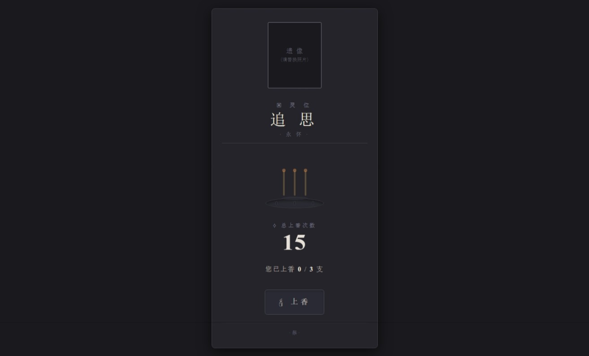

# 赛博灵堂 cyber-lingtang

## 🚀 部署指南（Cloudflare Workers）

### 绑定 KV 命名空间
- 进入刚创建的 Worker → **设置** → **变量**
- 在 **KV 命名空间绑定** 部分，点击 **“编辑变量”**
- **变量名称**：填写 `INCENSE_KV`（**必须与代码中的变量名一致**）
- **KV 命名空间**：选择你刚刚创建的 `INCENSE_COUNT`
- 保存。

## ⚙️ 配置说明

### 🖼️ 自定义照片与文字

- **遗像**：在 `worker.js` 的 `getHTML()` 函数中，找到 ``，将 `src` 替换为你的图片 URL（建议使用 Cloudflare Images 或任何可公开访问的链接）。
- **牌位文字**：修改 `
追思
` 和 `
· 永怀 ·
` 的内容。
- **标题**：修改 `<title>` 标签。

### ⚙️ 环境变量配置

| 变量名 | 描述 | 默认值 |
|--------|------|--------|
| `MAX_USER_INCENSE` | 每位用户最多可上香的次数 | `3` |

## 屏幕截图 Screenshot

